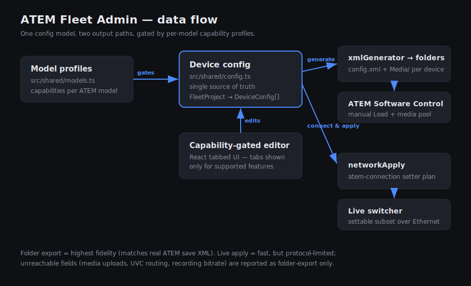

# ATEM Fleet Admin

Provision a **fleet of Blackmagic ATEM switchers at once**. Define any number of
ATEMs in one place, build each device's configuration through model-aware forms
(dropdowns + text fields), then either:

1. **Generate folders** — write a loadable `config.xml` + `Media/` folder per
   device for manual loading into ATEM Software Control, or
2. **Connect & apply** — push the settable subset of the config to a switcher
   over the network via [`atem-connection`](https://www.npmjs.com/package/atem-connection).

Built with electron-vite + React + TypeScript, matching the stack of its sibling
[animATEM](https://github.com/allansargeant/animATEM).



## Why

Configuring ATEMs one at a time in ATEM Software Control — input/output names,
SuperSource, media pools, streaming/recording, transitions — is slow and
error-prone across a fleet. Fleet Admin turns it into a single form-driven pass
with a repeatable, versionable project file (`*.afa.json`).

## Model-aware profiles

Each device is assigned a model. The editor shows only the tabs and options that
model supports, and the XML generator only emits the sections it has. Phase 1
ships two profiles spanning the two hardware classes:

| Capability              | ATEM Mini Extreme ISO | ATEM 4 M/E Broadcast Studio 4K |
| ----------------------- | :-------------------: | :----------------------------: |
| Input / output names    |          ✅           |               ✅               |
| Output routing (AUX)    |          ✅           |               ✅               |
| UVC / USB-C output      |          ✅           |               —                |
| Default transition      |          ✅           |               ✅               |
| Fade to black           |          ✅           |               ✅               |
| DVE                     |          ✅           |               ✅               |
| Media pool + players    |          ✅           |               ✅               |
| Streaming               |          ✅           |               —                |
| Recording (bitrate/ISO) |          ✅           |               —                |
| SuperSource             |           —           |               ✅               |
| Multi-M/E               |           —           |           ✅ (4 M/E)           |

Adding a model is a single new entry in [`src/shared/models.ts`](src/shared/models.ts).

## Fields covered

Input/output names · show/project name (recorder filename) · recording bitrate ·
recording mode (program vs ISO) · output sources incl. UVC · SuperSource layout &
sources · media pool items · media player assignments · streaming destination /
key / type / bandwidth · fade-to-black on/off · default transition time & type ·
DVE settings.

## The two output paths

### Generate folders (highest fidelity)

Pick an output directory; Fleet Admin writes:

```
<OutputDir>/<FleetName>/<DeviceName>/config.xml
<OutputDir>/<FleetName>/<DeviceName>/Media/...
```

Drag the `Media/` files into the switcher's media pool, then use ATEM Software
Control's **Load** to apply `config.xml`. The `<Profile>` XML matches the
element/attribute/nesting conventions of real ATEM save files
(see [`xmlGenerator.spec.ts`](src/main/services/xmlGenerator.spec.ts)).

### Connect & apply (live)

Set a network address on the Project tab and click **Connect & apply selected**.
The settable subset (input names, AUX routing, SuperSource boxes, media-player
assignments, transition/FTB rates, streaming service, ISO mode) is applied live.
Settings the Ethernet protocol can't reach — media-pool uploads, UVC routing,
recording bitrate — are reported as **folder-export only** so nothing is applied
silently.

> **Note on Mini streaming/recording XML.** No ATEM Mini save file was available
> as ground truth, so the Mini `<Streaming>`/`<Recording>` XML elements are
> reconstructed from the protocol and should be validated against a real Mini.
> The live **Connect & apply** path is the authoritative route for those fields.

## Two ways to run it

The same tool ships as **two targets** from this one repo, sharing all the
provisioning logic (`src/shared` + `src/main/services`):

1. **Electron desktop app** — the native app (`npm run dev`), packaged as
   installers on the main release. Uses IPC + native file dialogs.
2. **Web app + av-launcher tray shell** — a local Node server (`src/server`)
   serving the same React UI in the browser, wrapped by the fleet's
   [av-launcher](https://github.com/allansargeant/av-launcher) shell so it lives
   in the menu bar (pick interface + port, Start/Stop, Open). Ships as a
   self-contained desktop app with an embedded Node runtime — see
   [`launcher/`](launcher). This matches how the sibling
   [atem-overseer](https://github.com/allansargeant/atem-overseer) ships. The
   tray app ships for macOS, Windows and Linux (`.deb`/`.rpm`).

The React UI is identical across both; only `window.api` differs (Electron IPC
vs HTTP — see [`src/web/webApi.ts`](src/web/webApi.ts)).

## Develop

```bash
npm install

# Electron target
npm run dev          # launch the Electron app
npm run build        # electron-vite production build

# Web target
npm run server:dev   # run the web server (tsx watch) on :4720
npm run preview:web  # vite dev server for the web UI on :5199 (proxies /api → :4720)
npm run web          # build web + server, then serve at http://localhost:4720

# Shared
npm test             # vitest unit tests (XML generator, exporter, network apply)
npm run typecheck    # node (electron) + web + server
```

Electron installers: `npm run build:mac` / `build:win` / `build:linux`
(win/mac/linux × x64/arm64 via electron-builder). The av-launcher desktop app is
built by `.github/workflows/release-desktop.yml` (see [`launcher/README.md`](launcher/README.md)).

## Architecture

- [`src/shared/`](src/shared) — `models.ts` (capability profiles), `config.ts`
  (the single source-of-truth data model), `protocol.ts` (IPC types).
- [`src/main/services/`](src/main/services) — `xmlGenerator.ts`,
  `folderExporter.ts`, `fleetStore.ts`, `networkApply.ts`.
- [`src/renderer/src/`](src/renderer/src) — React UI: fleet sidebar +
  capability-gated tabbed device editor + export bar.

## Disclaimer

This project was developed with AI assistance (Claude). It is not affiliated
with or endorsed by Blackmagic Design. "ATEM" is a trademark of Blackmagic
Design. Generated configurations — especially the reconstructed Mini
streaming/recording XML — should be verified on your own hardware before use in
production.

## License

MIT
